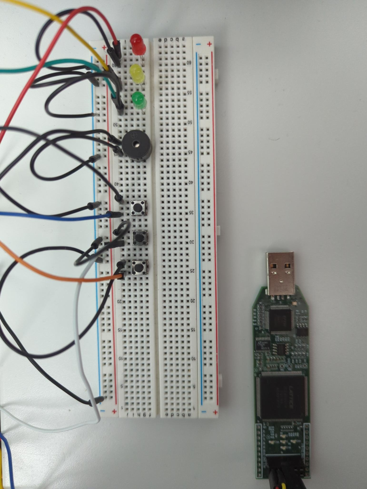

# Traffic Light

FPGA-based pedestrian-accessible traffic light controller written in Verilog.

Three lights (from top to bottom): Red light, Yellow light, Green light.

Buzzer for pedestrians.

Three buttons (from top to bottom): Off, Reset, Pedestrian.

***

List of Materials: 
- iCE40 FPGA x1
- Breadboard x1
- Red LED x1
- Yellow LED x1
- Green LED x1
- Piezo Buzzer x1
- Button x3
- Jumper Wire x15

***

Photos:

***

Features to implement: 
- Proper housing
